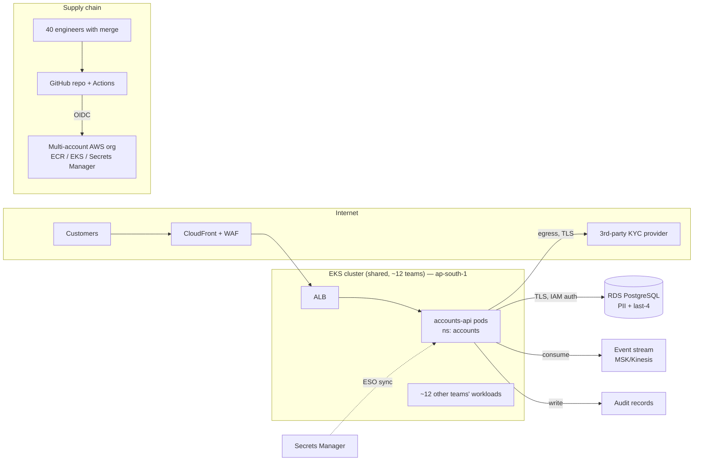

# Section 1 — Threat Model

## Trust boundaries

Trust boundaries crossed: internet→CloudFront/ALB, ALB→pod, pod→RDS, pod→internet (KYC),
pod↔neighbouring workloads (shared cluster), GitHub→AWS (OIDC), engineer→main branch,
laptop→SSO/CLI. **Assumption:** EKS API endpoint is private; cluster is v1.29+ with Pod
Security Admission available; IRSA/Pod Identity is in use.

## Top 5 threats, ranked by likelihood of materialising here

**T1 — Supply-chain compromise via the pipeline.** Entry: any of the 40 engineers' GitHub
accounts (phished token, malicious insider, poisoned PR) or a tampered workflow file.
Reaches: AWS credentials via OIDC, the production image, and therefore all customer data.
This is ranked first because the merge population is the largest attack surface in the
system and there is no security team reviewing changes.
→ **Controls built:** OIDC `sub` scoped to a protected environment (§2), keyless image
signing + verification (§2), pinned actions, branch protection assumptions, break-glass
audit trail (§3).

**T2 — RCE in accounts-api → lateral movement in the shared cluster.** Entry: the
internet-facing REST API (deserialisation, injection, vulnerable dependency). Reaches: the
pod's service account, its IAM role, the node if the workload is over-privileged — and
from the node, eleven other teams' workloads. The in-production manifest (Section 4a)
turns this from "one pod" into "the whole node" via docker.sock + hostNetwork.
→ **Controls built:** admission baseline (§5), fixed workload manifest + minimal RBAC
(§4a), least-privilege pod IAM (§4c), Falco rule + runbook (§5), default-deny egress (§5).

**T3 — Secret leakage through the repo or the workload.** Entry: a credential committed
to git (40 committers, no security team = it has already happened statistically), or
secrets exposed as env vars via `/proc`, crash dumps, or log lines. Reaches: RDS (all
PII), the KYC provider account.
→ **Controls built:** full-history secret scanning (§3), no plaintext in repo — ESO from
Secrets Manager (§6), file-mounted not env-mounted creds (§4a), rotation with an
emergency path (§6).

**T4 — Bulk PII exfiltration via over-privileged identity or exposed data plane.** Entry:
any foothold from T1–T3, or simply the internet (the in-production Terraform has RDS
`publicly_accessible` + `0.0.0.0/0` on 5432 — this is a breach waiting on a password).
Reaches: the entire customer dataset in one query.
→ **Controls built:** fixed Terraform + conftest rules that structurally prevent
recurrence (§4b), rewritten IAM policy (§4c), egress control (§5), encryption + redaction
(§6).

**T5 — Known-vulnerable dependency exploited in the internet-facing service.** Entry:
public CVE in a library the API loads on a request path. Reaches: initial code execution
(feeds T2). Ranked last of five: likely to occur, but the blast radius is bounded by the
T2 controls — which is exactly why those are enforced first.
→ **Controls built:** SCA gate with a real waiver path (§3), SBOM attestation so we can
answer "are we exposed?" in minutes (§2).

## The overrated threat

**Container-escape zero-days / kernel exotica.** In this environment every plausible
escape is a plain misconfiguration — the production manifest ships a docker.sock mount,
hostNetwork, root, and wildcard RBAC. An attacker doesn't need a kernel 0-day; we gave
them a documented API. Budget goes to admission control and identity scoping, not to
runtime kernel hardening. (Same logic deprioritises DDoS: CloudFront absorbs it and it
threatens availability, not the data a bank regulator examines.)

## Traceability

Every artefact in §2–§6 cites a T-number. One control does not map to a named threat:
**CloudTrail integrity fixes (§4b)**. Built anyway because a bank's audit trail is a
regulatory obligation independent of any attacker — and because every *response* to T1–T5
depends on trustworthy logs.
